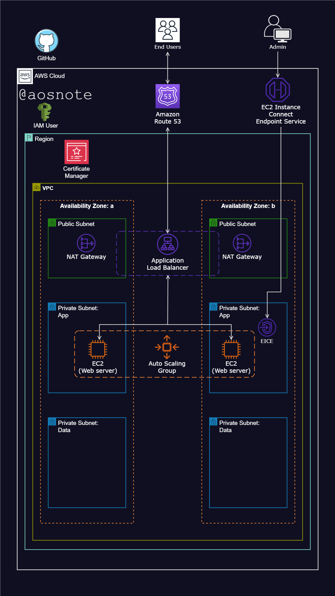

# Project: Hosting a Static Website on AWS

## Overview
This project aims to deploy a static HTML web application on AWS infrastructure utilizing various AWS services and resources. The deployment process involves setting up a Virtual Private Cloud (VPC), configuring subnets, security groups, Internet Gateway, NAT Gateway, Application Load Balancer, Auto Scaling Group, Route 53 for DNS management, and more.

## Reference Diagram


## Deployment Scripts
Below are the scripts used to deploy the static website on an EC2 instance:

```bash
#!/bin/bash
# Switch to the root user to gain full administrative privileges
sudo su
# Update all installed packages to their latest versions
yum update -y
# Install Apache HTTP Server
yum install -y httpd
# Change the current working directory to the Apache web root
cd /var/www/html
# Install Git
yum install git -y
# Clone the project GitHub repository to the current directory
git clone https://github.com/aosnotes77/host-a-static-website-on-aws.git
# Copy all files, including hidden ones, from the cloned repository to the Apache web root
cp -R host-a-static-website-on-aws/. /var/www/html/
# Remove the cloned repository directory to clean up unnecessary files
rm -rf host-a-static-website-on-aws
# Enable the Apache HTTP Server to start automatically at system boot
systemctl enable httpd
# Start the Apache HTTP Server to serve web content
systemctl start httpd
```

## Project Steps

1. **Virtual Private Cloud (VPC) Configuration:**
   - Configured a VPC with public and private subnets across two availability zones for enhanced fault tolerance.
   - Deployed an Internet Gateway to facilitate connectivity between VPC instances and the Internet.

2. **Security Measures:**
   - Established Security Groups to act as a network firewall mechanism.
   - Positioned web servers (EC2 instances) within private subnets for enhanced security.
   - Enabled instances in private subnets to access the Internet via the NAT Gateway.

3. **Infrastructure Setup:**
   - Utilized public subnets for components like the NAT Gateway and Application Load Balancer.
   - Implemented EC2 Instance Connect Endpoint for secure connections to assets within both public and private subnets.

4. **Website Hosting:**
   - Hosted the static website on EC2 instances within the private subnets.
   - Employed an Application Load Balancer and a target group for evenly distributing web traffic to an Auto Scaling Group of EC2 instances across multiple availability zones.
   - Utilized an Auto Scaling Group to automatically manage EC2 instances, ensuring website availability, scalability, fault tolerance, and elasticity.

5. **Version Control and Collaboration:**
   - Stored web files on GitHub for version control and collaboration.
   - Secured application communications using a Certificate Manager.

6. **Monitoring and Alerting:**
   - Configured Simple Notification Service (SNS) to alert about activities within the Auto Scaling Group.

7. **Domain Management:**
   - Registered the domain name and set up a DNS record using Route 53.

## Conclusion
By following this deployment process, a static HTML web application is successfully hosted on AWS infrastructure. The utilization of various AWS services ensures reliability, scalability, security, and fault tolerance for the hosted website.
